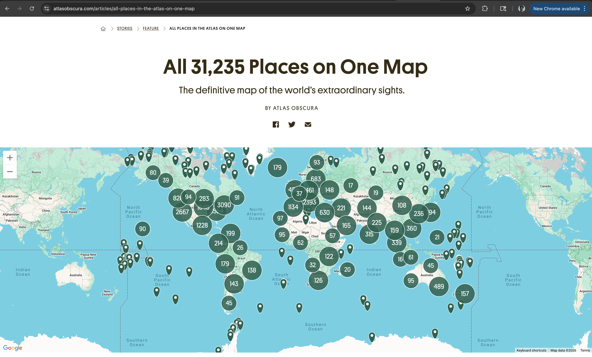

# Wanderlust Explorer

A curated travel-experience explorer built with Next.js, TypeScript, and Tailwind CSS. Discover 100 handpicked adventures, filter by category and destination, and save your favorites.

## Features

- **Browse 100 curated travel experiences** in a responsive card grid
- **Search by title** using case-insensitive regex filtering
- **Filter by category** (Adventure, Culture, Food, Wellness, Nature) and destination
- **All filters and search reflected in the URL** as query params for shareable links
- **Heart icon to save favorites** — persisted across all pages
- **5 distinct pages** with smooth client-side navigation (Home, Explore, Detail, Favorites, Profile)
- **Fully responsive design** optimized for mobile and desktop

## Tech Stack

- **Next.js 16** with App Router
- **TypeScript** for type-safe code
- **React** (useState, useEffect, useContext, custom hooks)
- **Tailwind CSS** for styling
- **lucide-react** for icons

## Getting Started

### Prerequisites
Node.js 18+ and npm

### Clone & Install

```bash
git clone https://github.com/4GeeksAcademy/alexterry12-nextjs-wanderlust-explorer.git
cd alexterry12-nextjs-wanderlust-explorer
npm install
```

### Run the development server

```bash
npm run dev
```

Open [http://localhost:3000](http://localhost:3000) in your browser to see the app.

## Project Structure

```
src/
├── app/
│   ├── layout.tsx              # Root layout with Favorites provider
│   ├── globals.css             # Global styles and CSS variables
│   ├── page.tsx                # Home page with hero section
│   ├── experiences/
│   │   ├── page.tsx            # Experiences listing with search/filter
│   │   └── [id]/
│   │       └── page.tsx        # Dynamic detail page for each experience
│   ├── favorites/
│   │   └── page.tsx            # Saved favorites page
│   └── profile/
│       └── page.tsx            # User profile with favorites count
├── components/
│   ├── Navbar.tsx              # Persistent navigation bar
│   ├── ExperienceCard.tsx       # Card component with favorite button
│   ├── ExperienceExplorer.tsx   # Client component with search/filter logic
│   ├── SearchBar.tsx           # Search input component
│   └── FilterBar.tsx           # Category and destination filters
├── context/
│   └── FavoritesContext.tsx    # React Context for favorites state
├── types/
│   └── experience.ts           # TypeScript interfaces
└── data/
    └── experiences.ts          # 100 curated experience objects
```

## Design References

The visual direction was inspired by these three sites:

### [Black Tomato](https://www.blacktomato.com)

Inspired the dramatic dark hero sections, bold all-caps headlines, generous whitespace, and premium editorial feel throughout the app.


### [Atlas Obscura](https://www.atlasobscura.com)

Inspired the editorial typography, the curated "discovery" feel for the experience cards, and the world-explorer narrative that ties the app together.



### [Airbnb Experiences](https://www.airbnb.com/s/experiences)

Inspired the card layout pattern (image on top, heart icon in the top-right corner, price and rating row at the bottom) and the intuitive search-and-filter interaction model.


## Author

Built by Alex Terry for the 4Geeks Academy bootcamp.

---

Happy exploring! 🌍

## Hero Video

Add `travel.mp4` to `public/` and use it as the looping muted background on the home hero section.